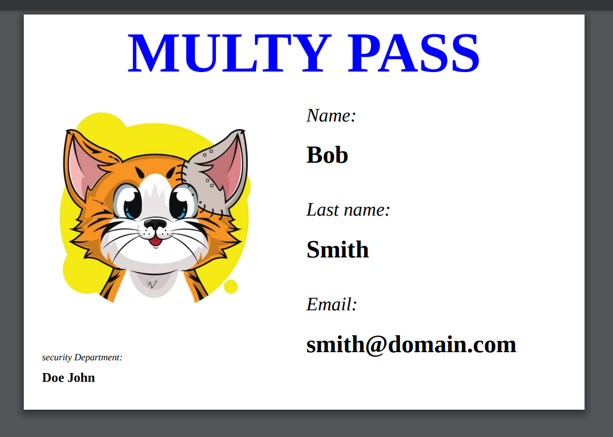

# Server 'User badge creator'.

> Database with authorization, CRUD users and PDF file creation with text and picture. 


---

[Description](#description) •
[Project setup](#project-setup) •
[Features](#features) •
[How To Use](#how-to-use) •
[Project Status](#project-status) •
[Room for Improvement](#room-for-improvement) •
[License](#license) •
[Contact](#contact)




## Description

Database with authorization and with the ability to add, delete and edit employee data. It is possible to create a badge with a photo and data of an employee in the database and save it locally in PDF format.

## Project setup

- Clone this repo to your desktop and run ```yarn``` or ```npm install``` to install all the dependencies.
- connect db (inject variables into .env file)
- Once the dependencies are installed, you can run ```yarn dev``` or ```npm dev``` to start the application.
- Enjoy.

> ### ```dockerized``` branche: 
> - Clone this repo to your desktop.
> - Install docker and docker-compose.
> - Run ```docker-compose up``` for run project.
> - Run ```docker-compose down``` for stop project.
> - Enjoy.

## Features
- CRUD with authorization.
- Load images to server.
- Assembly pdf file.
- Storing data in the database in binary form and local loading as a pdf file

## How To Use

Run [Live Demo](https://user-badge-creatorserver.uladzimirstanke.repl.co/swagger)

1. Create user
2. Login with created user
3. Add user avatar
4. Сreate user badge(``POST`` user email in ``users/badge``)
5. Load user badge from server using user id (``GET`` user id in ``users/badge/:id``)

## Project Status

Project is: *in progress*

## Room for Improvement

To do:
- [ ] Add refresh token
- [ ] Add admin and user rights

Improvement:
- [ ] Add Next client

## License

This project is open source and available under the [MIT](../LICENSE).

## Contact
Created by [@RimidalU](https://www.linkedin.com/in/uladzimir-stankevich/) - feel free to contact me!

<p align="right"><a href="#start"></a></p>

<!-- MARKDOWN LINKS & IMAGES -->

